# Introduction

This is my FINAL submission for CST1510 Coursework 2.

Student Name: JUGGOO Nardev

Student ID: M01100508

Course: CST1510 - CW2 - Multi-DomainIntelligencePlatform

## Project Description

A web interface built using streamlit module, that gives users a dashboard view, to see stats of Cybersecurity attacks

# Set-up Environment
##  Dependencies
### Arch dependencies
```shell
pacman -Sy --needed python python-virtualenv python-pip
```

### Python
```shell
pip install bcrypt pandas streamlit plotly matplotlib google-genai
```

## Steps:

```
python -m venv .venv
source .venv/bin/activate
pip install bcrypt pandas streamlit plotly matplotlib google-genai
echo 'GEMINI_API_KEY="..."' >> /path/to/.streamlit/secrets.toml


...
## After running
deactive
```

## Features

- Web Interface with 4 pages
- AI chactbot (that I need to figure out how to not pay to use)
- Secure password hashing using bcrypt with automatic salt generation
- User registration with duplicate username prevention, and a validator
- Userlogin wit hpassword verification and a password validator that enforces strong password and don't allow common passwords to be chosen
- Databse storage of user information
- based user data persistence
- Password Strength Indicator
- Assign user role
- Account lockout on login attempt exceeding 3
- Session Duration of max 5 mins

## Technical Implementation

- AI CHATBOT: `pip install -q -U google-genai`
- Web Interrface: streamlit
- Hashing Algorithm: bcrypt with automatic salting
- DataStorage: SQLite, with data loading of a `users.txt` file and loading of `{cyber_incidents,datasets_metadata,it_tickets}.csv` to gain access to those data
- Password Security: One-way hashing, no plain text storage
- Username Validation:  (3-20 alpha numeric characters)
- Password  (6-50 characters)
- Password Strength Indicator: Using a score which is incremented for 1, length greater than 8; 2, has upper case char; 3, has lower case; 4, has digit; 5, has special character; 6, is not part of a list of common passwords
- Assign user role: user, admin or analyst
- Account lockout on login attempt exceeding 3 for a user, using dict of list
- Session Duration: 5 mins, on until enter key presses, using sys and select

## Screenshots of project

### Using demo main function offered.


### Using main function from week 7 to add interactivity and validations 
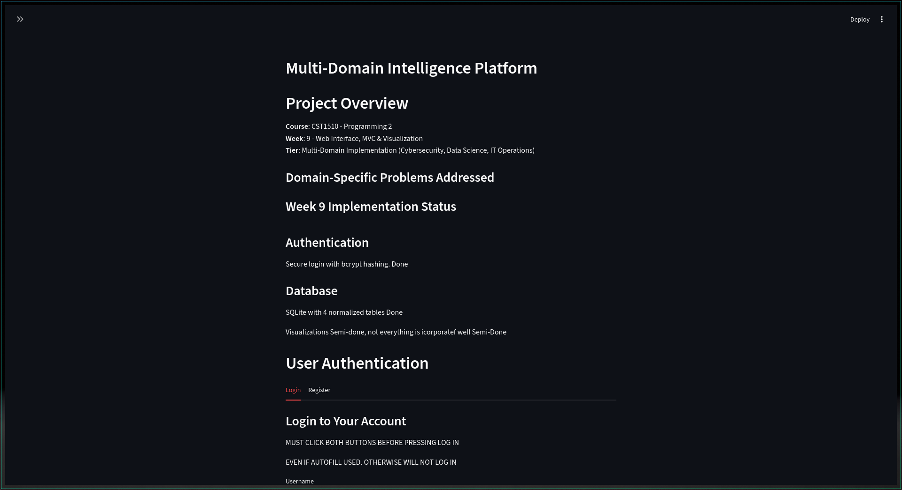
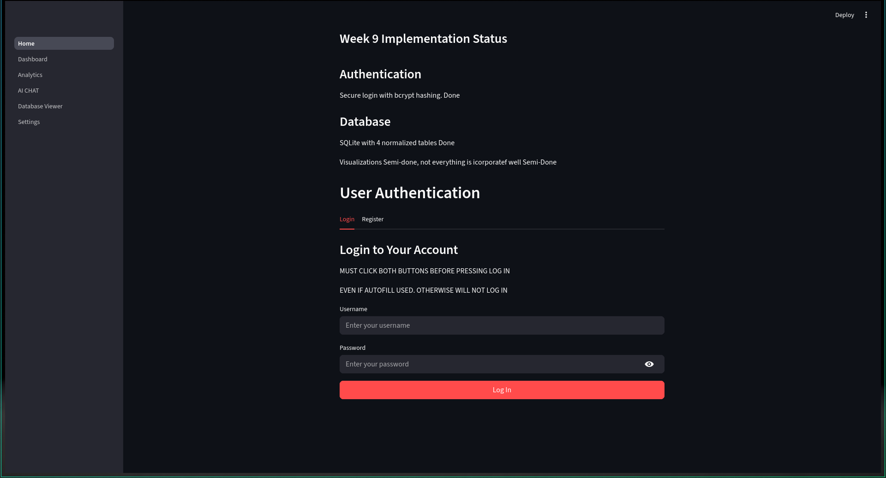
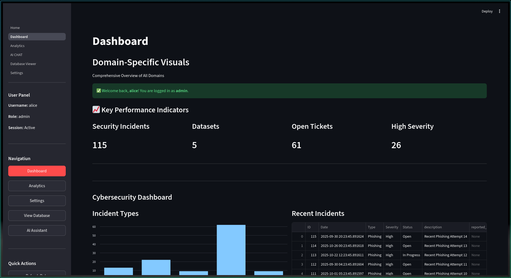
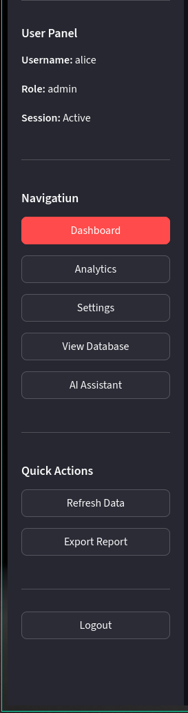
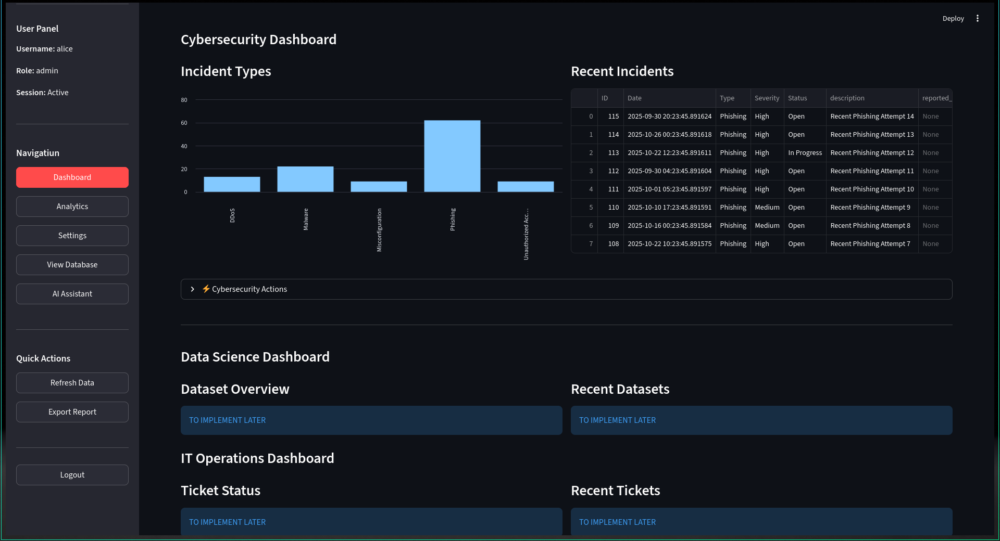
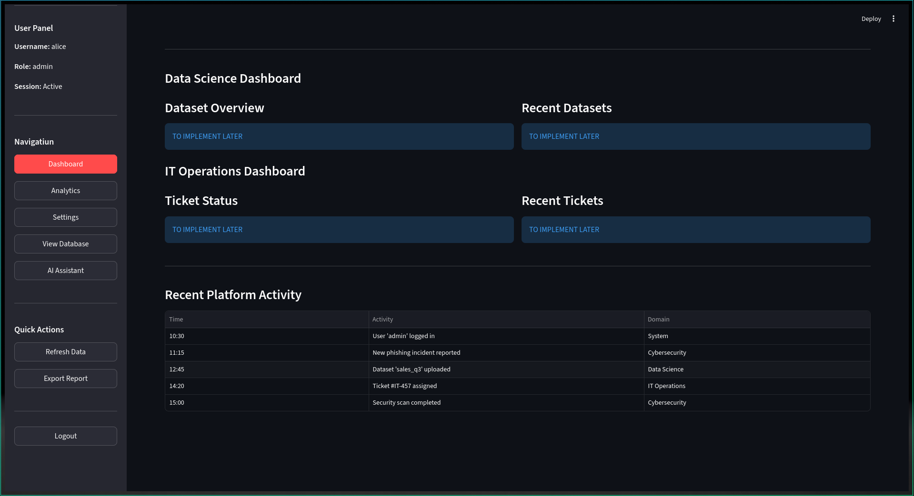
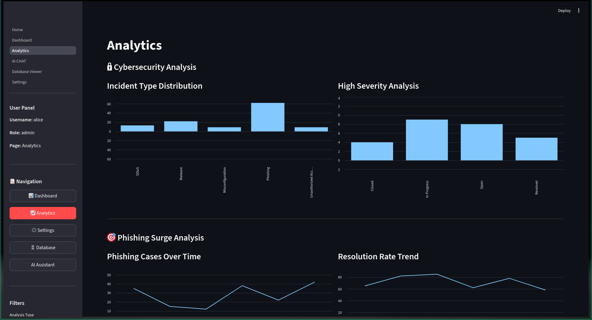
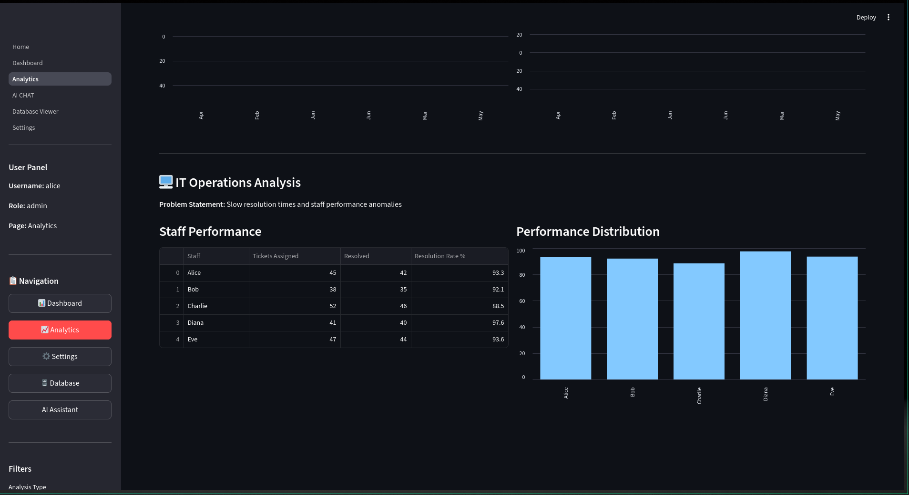
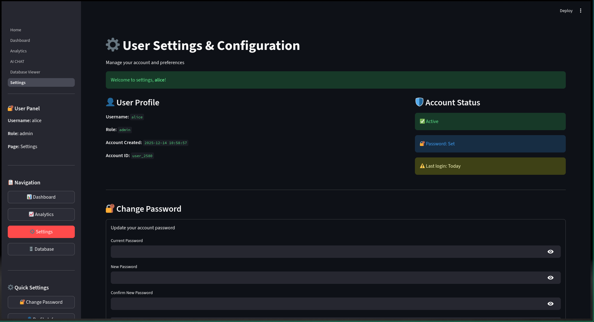
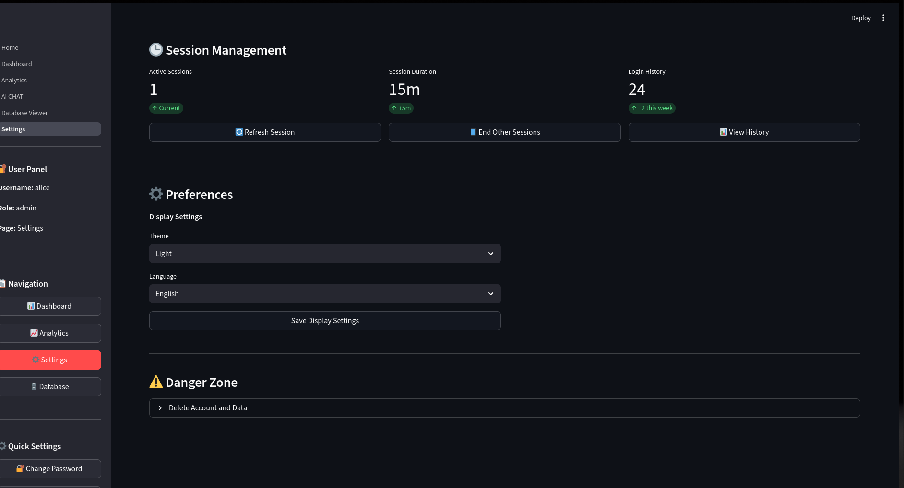
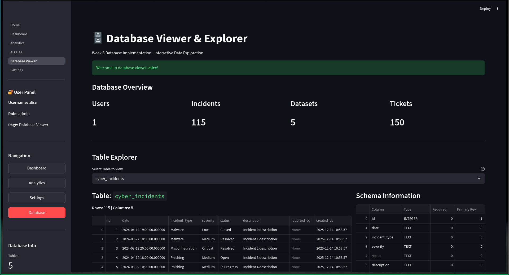
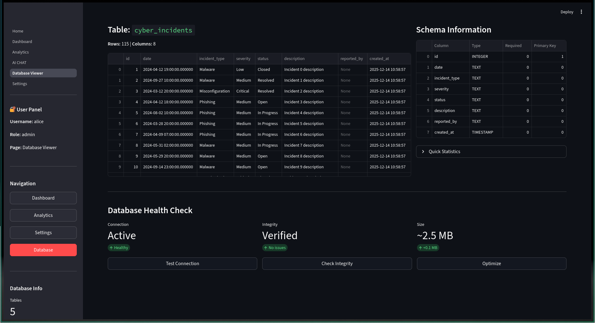
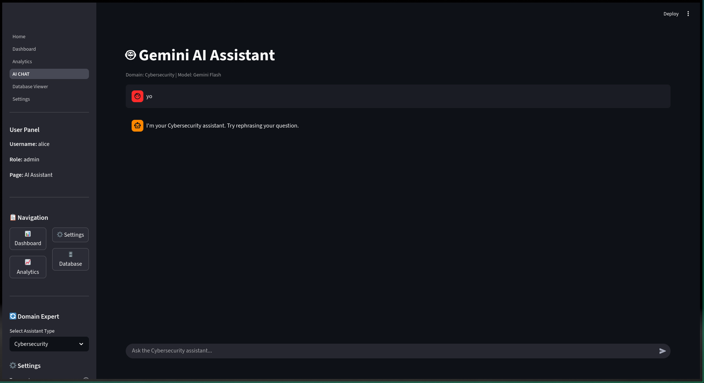
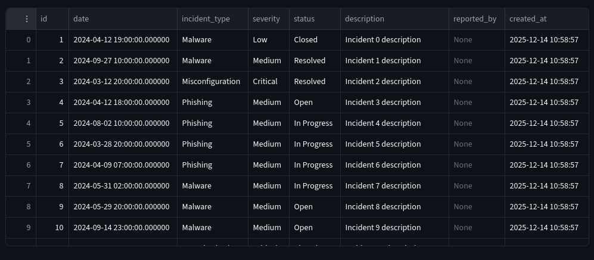
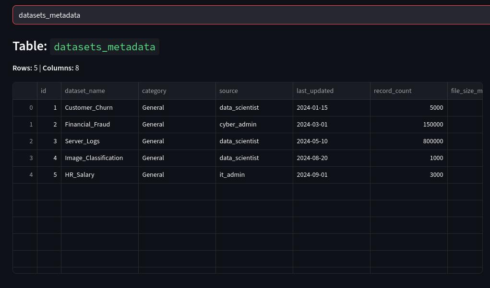
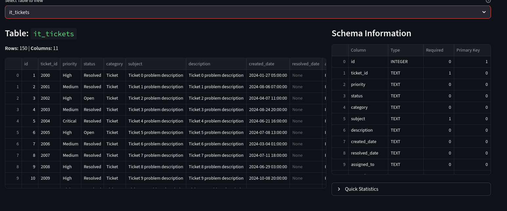
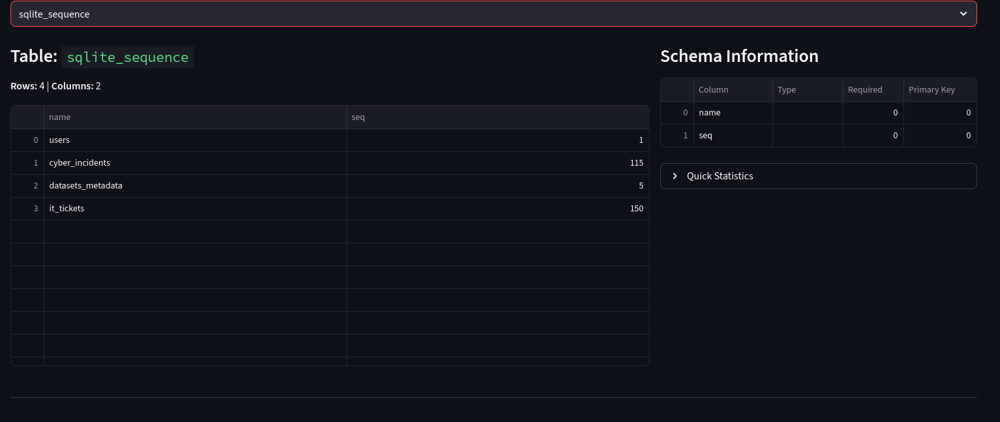
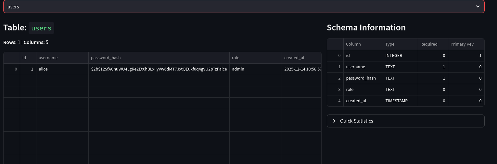

